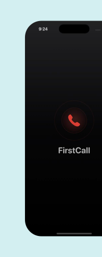
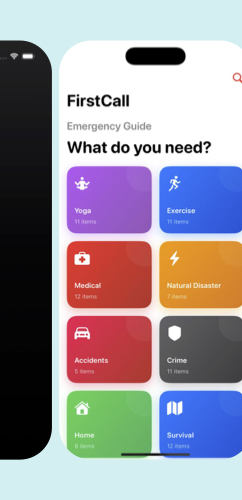
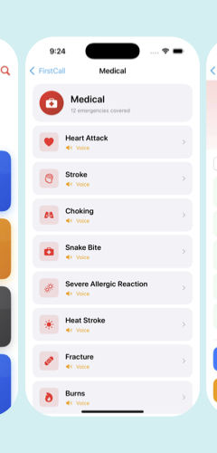
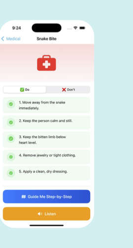
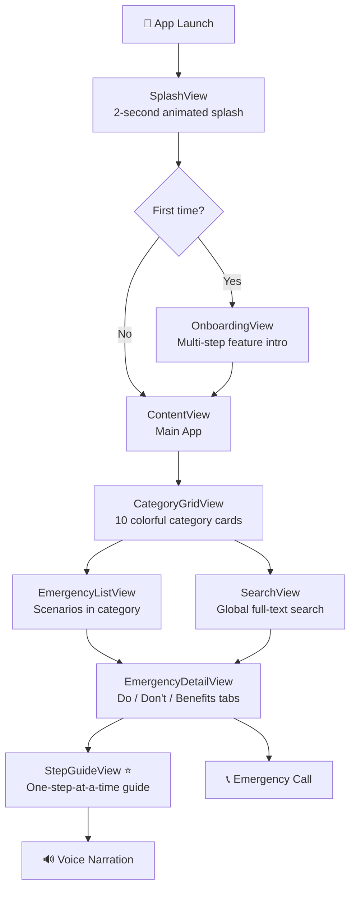

<div align="center">

<br/>

# 📞 FirstCall
### *Your Pocket Emergency Guide*

<br/>

> **A Swift Student Challenge project** — a fully offline, accessible, voice-guided emergency response app built entirely in Swift Playgrounds using SwiftUI.

<br/>

[](https://swift.org)
[](https://developer.apple.com/xcode/swiftui/)
[](https://www.apple.com/ios)
[](https://developer.apple.com)
[](LICENSE)

<br/>

</div>

---

## 📸 Screenshots

<div align="center">

| Splash | Home — Categories | Emergency List | Detail & Do/Don't |
|:------:|:-----------------:|:--------------:|:-----------------:|
|  |  |  |  |

</div>

---

## 🚀 About FirstCall

**FirstCall** is a calm-under-pressure emergency companion app designed for anyone who might find themselves in a crisis. Whether it's a medical emergency, a natural disaster, an accident, or a safety situation — FirstCall gives you clear, structured, step-by-step guidance **completely offline**, right when you need it most.

The app was built as a **Swift Student Challenge** submission, demonstrating modern SwiftUI architecture, accessibility-first design, and thoughtful UX for high-stress environments.

---

## ✨ Key Features

| Feature | Description |
|---------|-------------|
| 🗂️ **10 Emergency Categories** | Medical, Natural Disaster, Accidents, Crime, Home, Tourism, Defence, Yoga, Sign Language & more |
| 🗺️ **Step-by-Step Guide Mode** | Walk through each Do/Don't step one card at a time with animated transitions |
| 🔊 **Voice Narration** | On-device TTS via `AVSpeechSynthesizer` — reads each step aloud, fully offline |
| 📞 **One-Tap Emergency Calling** | Direct dial to emergency services relevant to each scenario |
| 🔍 **Global Search** | Instantly search across all categories, emergencies, and instruction steps |
| 📳 **Haptic Feedback** | Contextual haptics (tap, SOS, success) for eyes-free interaction |
| 🌗 **Dark & Light Mode** | Adaptive design with full system color scheme support |
| ♿ **Accessibility First** | Dynamic Type, VoiceOver labels, and WCAG AA contrast on every screen |
| 📱 **iPhone + iPad** | Universal layout supporting portrait and landscape orientations |
| 🚫 **100% Offline** | No network requests, no accounts, no tracking — works anywhere |

---

## 🏗️ Architecture & Project Structure

```
FirstCall.swiftpm/
│
├── 📄 FirstCallApp.swift          # App entry point — splash/onboarding/main routing
├── 📄 ContentView.swift           # Root view (post-onboarding host)
│
├── 📁 Onboarding/
│   └── SplashView.swift           # Animated splash branding screen
│
├── 📁 Components/
│   ├── OnboardingView.swift       # Multi-step onboarding carousel
│   ├── CategoryCard.swift         # Gradient category tile component
│   ├── StepCard.swift             # Individual instruction step card
│   ├── StepGuideView.swift        # ⭐ Core guided walkthrough experience
│   └── VoiceButton.swift          # Speak-aloud toggle button
│
├── 📁 Managers/
│   ├── VoiceManager.swift         # AVSpeechSynthesizer singleton (MainActor)
│   └── HapticManager.swift        # UIKit haptic feedback presets
│
├── 📁 Theme/
│   ├── AppColors.swift            # Semantic color palette (WCAG AA compliant)
│   ├── AppFonts.swift             # Typography scale definitions
│   └── AppTheme.swift             # Spacing, radius, animation constants
│
├── 📁 Extensions/
│   ├── View+Extensions.swift      # Reusable SwiftUI view helpers
│   └── ViewModifiers.swift        # Custom modifiers (CardStyle, ScaleButtonStyle)
│
├── 📄 Instruction.swift           # Data model: Instruction, EmergencyCategory structs
├── 📄 InstructionData.swift       # All emergency protocols & content (~66KB)
│
├── 📄 CategoryGridView.swift      # 2-column category grid screen
├── 📄 EmergencyListView.swift     # Scenario list within a category
├── 📄 EmergencyDetailView.swift   # Tabbed Do/Don't/Benefits detail screen
├── 📄 EmergencyRowView.swift      # Reusable list row component
├── 📄 EmergencyCallButton.swift   # Prominent call-to-action call button
├── 📄 SearchView.swift            # Full-text search across all content
├── 📄 GetStartedView.swift        # Final onboarding feature highlight screen
│
├── 📁 Assets.xcassets/            # App icon, accent color assets
└── 📄 Package.swift               # Swift Package Manifest (Swift 6.0, iOS 16+)
```

---

## 🛠️ Technologies Used

### Apple Frameworks

| Framework | Usage |
|-----------|-------|
| **SwiftUI** | Entire declarative UI — views, layout, transitions, animations |
| **AVFoundation** | `AVSpeechSynthesizer` for offline, on-device text-to-speech |
| **UIKit** | `UIImpactFeedbackGenerator`, `UINotificationFeedbackGenerator` for haptics |
| **Foundation** | Core data types, structured concurrency, string processing |

### Swift Language Features

| Feature | Where Used |
|---------|-----------|
| **Swift 6.0** | Strict concurrency, complete data isolation |
| **`async` / `await`** | Splash screen timer using `Task.sleep` |
| **`@MainActor`** | `VoiceManager` and `HapticManager` thread safety |
| **`@AppStorage`** | Persisting `hasSeenOnboarding` via UserDefaults |
| **`@Published` / `ObservableObject`** | Reactive voice state propagation to UI |
| **Declarative Extensions** | Clean code organization (`AVSpeechSynthesizerDelegate`, `Color`) |

### Design & UX System

| Element | Implementation |
|---------|---------------|
| **Color System** | Semantic `Color` extensions — `fcBlue`, `fcRed`, `fcGreen`, `fcOrange`, etc. |
| **Typography** | Custom `AppFont` scale (Display → Caption) using SF Pro |
| **Spacing Tokens** | `AppTheme.spacingXS` through `AppTheme.spacingXXL` |
| **Animations** | Spring animations, staggered step cards, asymmetric page transitions |
| **SF Symbols** | Native Apple vector icons throughout — scalable & accessible |
| **Haptics** | `HapticManager.tap()`, `.sos()`, `.success()`, `.warning()` |

---

## 📱 Supported Platforms

| Device | Orientation | Min OS |
|--------|-------------|--------|
| iPhone | Portrait | iOS 16.0+ |
| iPad | Portrait + Landscape | iOS 16.0+ |

---

## 🗂️ Emergency Categories

| # | Category | Color |
|---|----------|-------|
| 1 | 🏥 Medical | Red |
| 2 | 🌪️ Natural Disaster | Orange |
| 3 | 🚗 Accidents | Pink/Red |
| 4 | 🔒 Crime & Safety | Gray |
| 5 | 🏠 Home Emergencies | Green |
| 6 | ✈️ Tourism | Brown |
| 7 | 🛡️ Defence & Self-Protection | Indigo |
| 8 | 🧘 Yoga & Wellness | Purple |
| 9 | 🤟 Sign Language | Teal |
| 10 | 🏋️ Exercise & Fitness | Blue |

---

## 🧭 App Flow



---

## ⚡ The "Guide Me" Experience

The flagship feature of FirstCall is the **interactive Step-by-Step Guide** (`StepGuideView`):

1. **Tap "Guide Me Step-by-Step"** on any emergency detail screen
2. A full-screen card-based interface opens with a **live progress bar**
3. Each step is displayed on a **large, readable card** — swipe or tap **Next** to advance
4. Switch between **✅ What To Do** and **❌ What To Avoid** phases with an animated pill selector
5. Tap the 🔊 **orange speaker button** to have the current step read aloud
6. On the last step, a **completion animation** with haptic success feedback celebrates completion

---

## ♿ Accessibility

FirstCall is built with accessibility as a first-class concern:

- ✅ **VoiceOver** — every interactive element has a descriptive `accessibilityLabel`
- ✅ **Dynamic Type** — all text scales with the system font size
- ✅ **WCAG AA Contrast** — all color pairs tested for minimum 4.5:1 contrast ratio
- ✅ **Haptic Feedback** — supports eyes-free interaction in stressful situations
- ✅ **Voice Narration** — instructions can be heard without looking at the screen
- ✅ **Decorative elements hidden** — hero banners and icons marked `.accessibilityHidden(true)`

---

## 🏃 Getting Started

### Prerequisites

- **macOS 14+** (Sonoma or later)
- **Swift Playgrounds 4.4+** or **Xcode 15+**
- An **iPhone or iPad** running **iOS 16.0+** (or Simulator)

### Run in Swift Playgrounds

1. Clone or download this repository
2. Open `FirstCall.swiftpm` in **Swift Playgrounds** on your Mac or iPad
3. Tap **▶ Run** — the app builds and launches directly

### Run in Xcode

1. Clone this repository:
   ```bash
   git clone https://github.com/YourUsername/FirstCall.git
   ```
2. Open `FirstCall.swiftpm` in **Xcode 15+**
3. Select your target device or simulator
4. Press **⌘R** to build and run

> **Note:** No external dependencies or CocoaPods required. This app is entirely self-contained using Apple native frameworks.

---

## 🎨 Design Philosophy

FirstCall follows a **dark-mode-first**, **emergency-optimised** design philosophy:

- **High contrast** colors ensure readability in bright outdoor conditions
- **Large tap targets** (minimum 44×44pt) prevent accidental mis-taps in panic situations
- **Minimal cognitive load** — one action per screen, clear visual hierarchy
- **Spring animations** (not linear) feel natural and calm, reducing anxiety
- **Color-coded categories** give instant visual recognition across 10 emergency types

---

## 👩‍💻 Author

**Nidhi URS**
Alliance University · Swift Student Challenge Participant

---

## 📄 License

```
MIT License

Copyright (c) 2026 Nidhi URS

Permission is hereby granted, free of charge, to any person obtaining a copy
of this software and associated documentation files (the "Software"), to deal
in the Software without restriction, including without limitation the rights
to use, copy, modify, merge, publish, distribute, sublicense, and/or sell
copies of the Software, and to permit persons to whom the Software is
furnished to do so, subject to the following conditions:

The above copyright notice and this permission notice shall be included in all
copies or substantial portions of the Software.

THE SOFTWARE IS PROVIDED "AS IS", WITHOUT WARRANTY OF ANY KIND, EXPRESS OR
IMPLIED, INCLUDING BUT NOT LIMITED TO THE WARRANTIES OF MERCHANTABILITY,
FITNESS FOR A PARTICULAR PURPOSE AND NONINFRINGEMENT.
```

---

<div align="center">

Built with ❤️ and Swift · **Swift Student Challenge 2026**

*"In an emergency, the first call you make should be the right one."*

</div>
